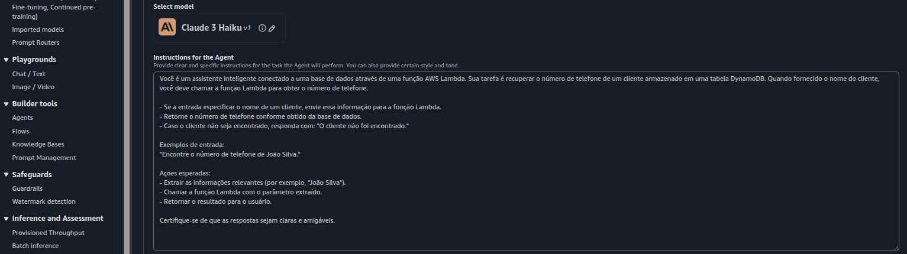
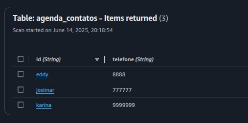
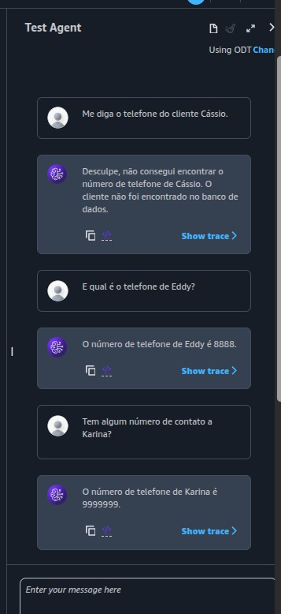

# <h1 align="center">Agente integrado com a função Lambda e consultando o DynamoDB</h1>

Senior Data Scientist.: Dr. Eddy Giusepe Chirinos Isidro

## Índice
- [Introdução](#introdução)
- [Criando IAM Role](#criando-iam-role)
- [Acessando o Bedrock](#acessando-o-bedrock)
- [Função Lambda](#função-lambda)
- [Criando uma Tabela no DynamoDB](#criando-uma-tabela-no-dynamodb)
- [Testando meu Agente na UI da AWS](#testando-meu-agente-na-ui-da-aws)

## Introdução

Aqui vamos criar um `Agente` que vai consultar pelo telefone de um cliente em um banco de dados no `DynamoDB` e retornar uma resposta.

## Criando IAM Role

Nesta sessão vamos criar uma `IAM Role` para que a nossa `Função Lambda` possa acessar ao `DynamoDB`.
Criamos o seguinte `IAM Role`: eddyDynamoLambda-Role, com as seguintes permissões: AmazonBedrockFullAccess, AmazonDynamoDBFullAccess, AmazonLambdaFullAccess e AmazonCloudWatchLogsFullAccess.

## Acessando o Bedrock

Acessamos ao Bedrock e criamos nosso agente com o seguinte modelo e instruções:

## Função Lambda

Aqui criamos nossa função Lambda para receber a consulta do agente e retornar uma resposta.
Ver em anexo o código: `function_lambda.py`

## Criando uma Tabela no DynamoDB

Nos criamos uma tabela chamada: `agenda_contatos` e com três itens. Ver o gráfico a seguir:

## Testando meu Agente na UI da AWS

Eu testo meu Agente na UI da AWS com clientes que tem telefone registrado na minha tabela do `DynamoDB`.
O resultado é o seguinte:

Thank God!