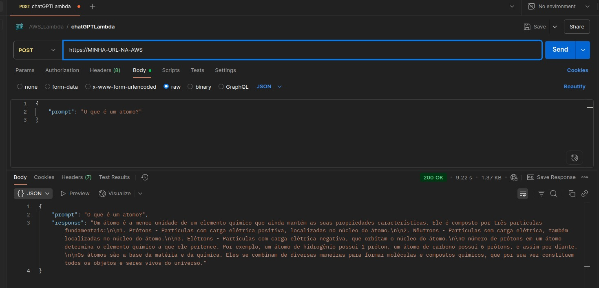

# <h1 align="center"><font color="gree">A Guide to Building ChatGPT on AWS</font></h1>

<font color="pink">Senior Data Scientist.: Dr. Eddy Giusepe Chirinos Isidro</font>


## <font color="red">Índice</font>
- [Introdução](#introdução)
- [Solicitando acesso aos modelos de AI no Bedrock](#solicitando-acesso-aos-modelos-de-ai-no-bedrock)
- [Criando nosso IAM Role](#criando-nosso-iam-role)
- [Criando a função Lambda](#criando-a-função-lambda)
- [Usando a API Gateway](#usando-a-api-gateway)


## <font color="red">Introdução</font>

Aqui vamos criar um serviço similar ao ChatGPT, onde você pode fazer queries e receber respostas.
Basicamente, usaremos o PROMPT para chamar o modelo de AI em segundo plano, gerar uma resposta e retornar para o usuário/cliente.
Temos, uma API Gateway que recebe a sua requisição, depois chama à função lambda, depois a função lambda chama ao bedrock (em segundo plano) e depois retorna a resposta para o usuário/cliente. O gráfico acima ilustra o arquitetura/pipeline do nosso `chatGPT`.


## <font color="red">Solicitando acesso aos modelos de AI no `Bedrock`</font>
Nesta seção você vai solicitar acesso aos modelos de AI no `Bedrock`.


## <font color="red">Criando nosso ``IAM Role``</font>

Nesta seção vamos criar uma `IAM Role` para que a nossa `Função Lambda` possa acessar o `Bedrock` e `CloudWatchLogs`. Basicamente, fiz o seguinte:

```
IAM > Roles > Create role > AWS Service > Lambda > Next: Permissions (AmazonBedrockFullAccess, CloudWatchLogsFullAccess, etc) > Create role > Role name: `ChatGPTLambdaRole` > Create role
```

## <font color="red">Criando a função `Lambda`</font>
Nesta seção vamos criar a função `Lambda` (escrever código `python`) que vai ser responsável por receber a requisição do usuário, chamar o modelo de AI e retornar a resposta.

O que fiz aqui foi o seguinte: criei a função Lambda (com nome `chatGPTLambda`), escolhi o `Python 3.12`, depois escolhi `ChatGPTLambdaRole` o que criamos na seção anterior, etc.

`OBS:` Em configuration aumentei o `timeout` para 120 segundos (2 minutos), pois o modelo de AI pode demorar um pouco para responder.


## <font color="red">Usando a `API Gateway`</font>
Nesta seção vamos usar a `API Gateway` para criar um ponto de extremidade para que o usuário possa fazer requisições e receber respostas.

Aqui segui o seguinte caminho:

API Gateway > Create API (new API) > API name (`chatgpt-api-aws`) > criar recurso (`ask-chatgpt`) > criar o método (`POST`) >   


## <font color="red">Inferência</font>




Thank God 🤗!