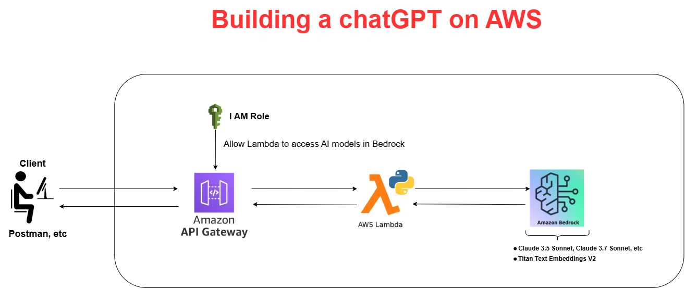

# <h1 align="center">A Guide to Building ChatGPT on AWS</h1>

Senior Data Scientist.: Dr. Eddy Giusepe Chirinos Isidro

## Introduction
Aqui vamos criar um serviço similar ao ChatGPT, onde você pode fazer queries e receber respostas.
Basicamente, usaremos o PROMPT para chamar o modelo de AI em segundo plano, gerar uma resposta e retornar para o usuário/cliente.
Temos, uma API Gateway que recebe a sua requisição, depois chama à função lambda, depois a função lambda chama ao bedrock (em segundo plano) e depois retorna a resposta para o usuário/cliente. O seguinte gráfico ilustra o processo:

## Criando nosso ``IAM Role``

Vamos criar uma função IAM para que a nossa Função Lambda possa acessar o Bedrock e CloudWatchLogs.

Thank God!